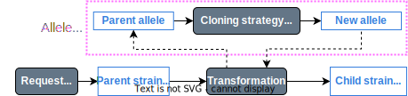
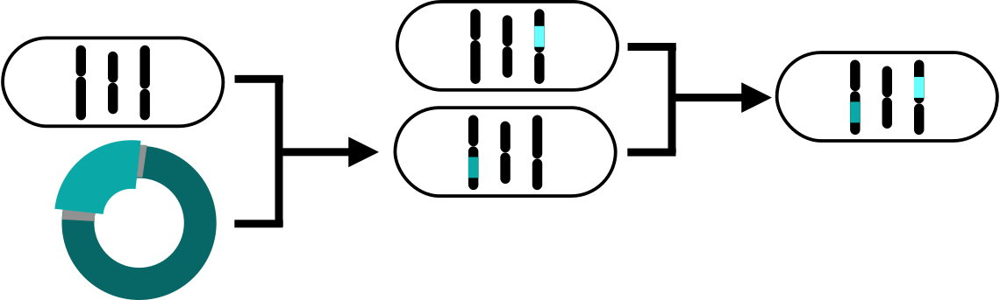

# 🦠 What about strains? 🦠

## 🧬 Describing a genotype

The genotype of a strain is a **list of the alleles that differ from the wild-type or reference strain**. If we can describe an allele, we can describe a **genotype as an array of alleles**.

## 🤔 What's an allele then?

With a standard format for cloning strategies, we can describe an **allele as a sequence that originated from a fragment of the reference genome sequence**.
* Storing the genome coordinates of the template sequence used as cloning input.
* Storing the product sequence, and cloning strategy.

    

## 🦠 How do you define a strain source?

1. Strain sources that generate new alleles have an associated "Allele Source".

    

2. Mating is just a shuffling of existing alleles

    

# 🔮 Planned features 🔮

A web application with a database storing these entities and their relationships, where you can:

* 🔍 **Browse and query your collection** 🔍
  * Ancestry and progeny of all resources.
  * Rich queries:
    * Alleles of a certain gene
    * Plasmids with a given marker
* 📎 **Attach supporting evidence** 📎
  * Gel images
  * Sequencing data that is automatically aligned with expected sequence.
* ♻️ **Standardisation from planning stage**♻️
  * Planned resources selectable for further manipulations without being part of main collection.
  * Links to knowledgebases.
* 🪱🐀 **Multiple strain backgrounds & species** 🦒🐉
* 📓⚙️ **Integration with ELNs and other tools** ⚙️📓
  * Not an alternative, an add-on!
* 📜📩**One Click Export/Report/Share/Publish**📩📜
  * Generate "Materials and Methods" text and files.
  * Generate publisher-specific tables (e.g., STAR).
  * Submit to repositories and generate unique IDs.
* 💰**Rich sequence features**💰
  * Combined with provenance:
    * Genetic meaning of alleles.
    * Automatic naming of alleles.
  * Enabled by the Synthetic Biology Open Language (SBOL).

# 🙋 Get involved! 🙋‍♂️

This project has received funding for 2 years starting September 2023, and we are looking for beta-testing labs.
If you are interested, get in touch in the link below.

Visit <a href="https://www.genestorian.org">https://www.genestorian.org<a>

<h2 style='text-align: center; margin-bottom: 145%'> 📃 Paste your ideas here 📃 </h2>

